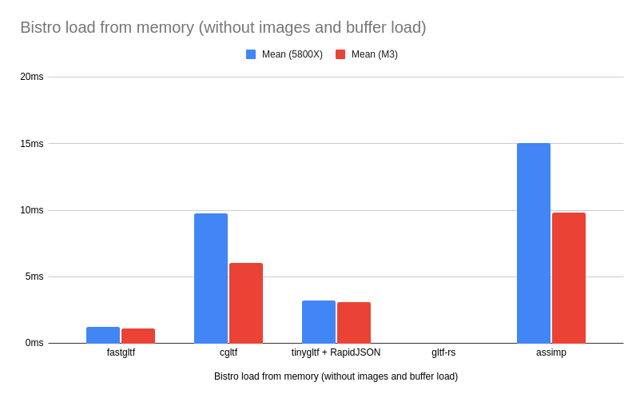

# glTF Discussion

## What is glTF?

glTF is a file format for scenes and models and will let us not worry about figuring out a good file format for our scene / scene graph (Real-Time Rendering 4th ed., 19.1.5 Scene Graphs).

<https://registry.khronos.org/glTF/specs/2.0/glTF-2.0.html#gltf-basic>

>
> A glTF asset is represented by:
>
> - A JSON-formatted file (`.gltf`) containing a full scene description: node hierarchy, materials, cameras, as well as descriptor information for meshes, animations, and other constructs.
>
> - Binary files (`.bin`) containing geometry, animation, and other buffer-based data.
>
> - Image files (`.jpg`, `.png`) containing texture images.
>
> Binary and image resources **MAY** also be embedded directly in JSON using Data URI or stored side-by-side with JSON in GLB container.

## glTF specific loader / assimp?

In this section, I'm going to explain why I think using a glTF specific file loader, cgltf, will be a better choice than using assimp. I'll motivate my choice of cgtlf over another glTF loader in the [cgltf / fastgltf?](#cgltf--fastgltf) section.

In my opinion, we need to dedicate ourselves to the glTF format and not worry about other file formats. We can still load individual files with another loader, maybe a dedicated obj loader for example.

As such, we should look for APIs which keep us as close to the glTF format as possible. It will help us understand what we're loading in and what we're writing out. Especially when eventually we have the ability to edit scenes using our engine. This is the main benefit of cgltf over assimp.

### API comparison

#### The JSON structure of glTF

This is the general structure we are trying to match.


<https://github.khronos.org/glTF-Tutorials/gltfTutorial/gltfTutorial_002_BasicGltfStructure.html>

#### cgltf API

<https://github.com/jkuhlmann/cgltf/blob/master/cgltf.h>

> `cgltf_data` is the struct allocated and filled by `cgltf_parse()`.
It generally mirrors the glTF format as described by the spec (see
<https://github.com/KhronosGroup/glTF/tree/master/specification/2.0).>)

We can see how closely `cgltf_data` matches the glTF format:

```c
typedef struct cgltf_data
{
    cgltf_file_type file_type;
    void* file_data;

    cgltf_asset asset;

    cgltf_mesh* meshes;
    cgltf_size meshes_count;

    cgltf_material* materials;
    cgltf_size materials_count;

    cgltf_accessor* accessors;
    cgltf_size accessors_count;

    cgltf_buffer_view* buffer_views;
    cgltf_size buffer_views_count;

    cgltf_buffer* buffers;
    cgltf_size buffers_count;

    cgltf_image* images;
    cgltf_size images_count;

    cgltf_texture* textures;
    cgltf_size textures_count;

    cgltf_sampler* samplers;
    cgltf_size samplers_count;

    cgltf_skin* skins;
    cgltf_size skins_count;

    cgltf_camera* cameras;
    cgltf_size cameras_count;

    cgltf_light* lights;
    cgltf_size lights_count;

    cgltf_node* nodes;
    cgltf_size nodes_count;

    cgltf_scene* scenes;
    cgltf_size scenes_count;

    cgltf_scene* scene;

    cgltf_animation* animations;
    cgltf_size animations_count;

    /* ... */
} cgltf_data;
```

```c
struct cgltf_node {
	char* name;
	cgltf_node* parent;
	cgltf_node** children;
	cgltf_size children_count;
	cgltf_skin* skin;
	cgltf_mesh* mesh;
	cgltf_camera* camera;
	cgltf_light* light;
	cgltf_float* weights;
	cgltf_size weights_count;
	cgltf_bool has_translation;
	cgltf_bool has_rotation;
	cgltf_bool has_scale;
	cgltf_bool has_matrix;
	cgltf_float translation[3];
	cgltf_float rotation[4];
	cgltf_float scale[3];
	cgltf_float matrix[16];
	cgltf_extras extras;
	cgltf_bool has_mesh_gpu_instancing;
	cgltf_mesh_gpu_instancing mesh_gpu_instancing;
	cgltf_size extensions_count;
	cgltf_extension* extensions;
};
```

#### assimp API

<https://github.com/assimp/assimp/blob/master/include/assimp/scene.h>

Whereas the assimp API is obviously a little bit futher away...

```c
struct ASSIMP_API aiScene {
    unsigned int mFlags;

    C_STRUCT aiNode* mRootNode;

    unsigned int mNumMeshes;
    C_STRUCT aiMesh** mMeshes;

    unsigned int mNumMaterials;
    C_STRUCT aiMaterial** mMaterials;

    unsigned int mNumAnimations;
    C_STRUCT aiAnimation** mAnimations;

    unsigned int mNumTextures;
    C_STRUCT aiTexture** mTextures;

    unsigned int mNumLights;
    C_STRUCT aiLight** mLights;

    unsigned int mNumCameras;
    C_STRUCT aiCamera** mCameras;

    C_STRUCT aiMetadata* mMetaData;

    C_STRUCT aiString mName;

    unsigned int mNumSkeletons;
    C_STRUCT aiSkeleton **mSkeletons;

    /* ... */
};
```

```c
struct ASSIMP_API aiNode {
    C_STRUCT aiString mName;

    C_STRUCT aiMatrix4x4 mTransformation;

    C_STRUCT aiNode* mParent;

    unsigned int mNumChildren;
    C_STRUCT aiNode** mChildren;

    unsigned int mNumMeshes;
    unsigned int* mMeshes;

    /* ... */
};
```

## cgltf / fastgltf?

### Features comparison

My main reason for wanting to use cgltf over fastgltf is the following comparison table. You can see that fastgltf does not support image decoding, which is probably something we would like to use.

<https://fastgltf.readthedocs.io/latest/overview.html>

>| Feature                         | cgltf | tinygltf | fastgltf |
|---------------------------------|:-----:|:--------:|:--------:|
| glTF 2.0 reading                | ✅     | ✅        | ✅        |
| glTF 2.0 writing                | ✅     | ✅        | ✅        |
| Extension support               | ✅     | 🟧¹       | ✅        |
| Image decoding (PNG, JPEG, …)   | ✅     | ✅        | ❌        |
| Built-in Draco decompression    | ❌     | ✅        | ❌        |
| Memory callbacks                | ✅     | ❌        | 🟧²       |
| Android asset functionality     | ❌     | ✅        | ✅        |
| Accessor utilities              | ✅     | ❌        | ✅        |
| Sparse accessor utilities       | 🟧³    | ❌        | ✅        |
| Matrix accessor utilities       | 🟧³    | ❌        | ✅        |
| Node transform utilities        | ✅     | ❌        | ✅        |
>
> ¹ tinygltf does provide the JSON structure for extension data, but leaves the deserialization for you to do. ² fastgltf allows the user to allocate memory for buffers and images. It does not provide any mechanism for controlling all the heap allocations the library performs. ³ cgltf supports sparse accessors and matrix data only with some accessor functions, but not all.

### Peformance comparison

Also, I don't think we should worry about performance much (comparison below). Yes, fastgltf is in theory faster (ignoring the performance cost of us hand coding image decoding). But loading isn't meant to be that quick and you can see all these loaders do quite a good job.


<https://fastgltf.readthedocs.io/latest/overview.html>

## More motivation

Take it from [Sacha Willems](https://www.saschawillems.de/blog/2020/06/06/new-vulkan-gltf-examples/):
> **Moving to glTF**
>
> When I started writing my first Vulkan samples glTF was still in it’s infancy, esp. in terms of tooling. So I went with more common formats and went with the Open Asset importer library (Assimp) for loading these.
>
> But things rapidly changed with glTF 2.0, which is now pretty much and industry standard and supported by many DCC tools. And since both Vulkan and glTF are both Khronos standards this is a perfect match.
>
> So I decided to move away from Assimp, and started updating my Vulkan samples to use glTF instead.
